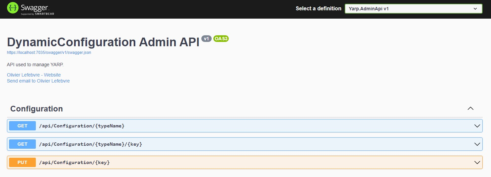
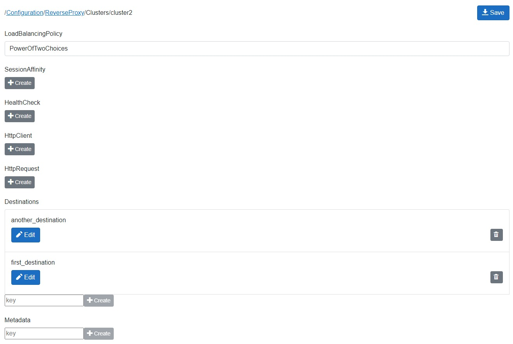

# DynamicConfiguration

Manage your .NET application configuration dynamically.

[](https://sonarcloud.io/dashboard?id=Aguafrommars_DynamicConfiguration)  

[](https://ci.appveyor.com/project/aguacongas/dynamicconfiguration/branch/main)

## Description

This repository contains the source code of .NET library to dynamicaly configure your .NET applications.

``` bash
├─ sample  
|  ├─ RedisConfigurationSample  
|  ├─ YarpSample
├─ src
|  ├─ Aguacongas.DynamicConfiguration
|  ├─ Aguacongas.DynamicConfiguration.Redis
|  ├─ Aguacongas.DynamicConfiguration.WebApi
|  └─ Blazor
|     └── Aguacongas.DynamicConfiguration.Razor
└─ test
```

### Services

[Aguacongas.DynamicConfiguration](src/Aguacongas.DynamicConfiguration/README.md) contains interfaces and services to dynamically configure .NET programs. 

### Providers

[Aguacongas.DynamicConfiguration.Redis](src/Aguacongas.DynamicConfiguration.Redis/README.md) contains a [Configuration provider](https://docs.microsoft.com/en-us/dotnet/core/extensions/configuration-providers) implementation for [Redis](https://redis.io/). 

### Web API
[Aguacongas.DynamicConfiguration.WebApi](src/Aguacongas.DynamicConfiguration.WebApi/README.md) contains a Web API to read and store the configuration. 



### Components

[Aguacongas.DynamicConfiguration.Razor](src/Blazor/Aguacongas.DynamicConfiguration.Razor/Readme.md) contains Razor components to manage the configuration.



## Setup

Each project contains a *Readme.md* containing information to use the library.

## Build from source

You can build the solution with Visual Studio or use the `dotnet build` command.  

## Contribute

We warmly welcome contributions. You can contribute by opening an issue, suggest new a feature, or submit a pull request.

Read [How to contribute](CONTRIBUTING.md) and [Contributor Covenant Code of Conduct](CODE_OF_CONDUCT.md) for more information.
