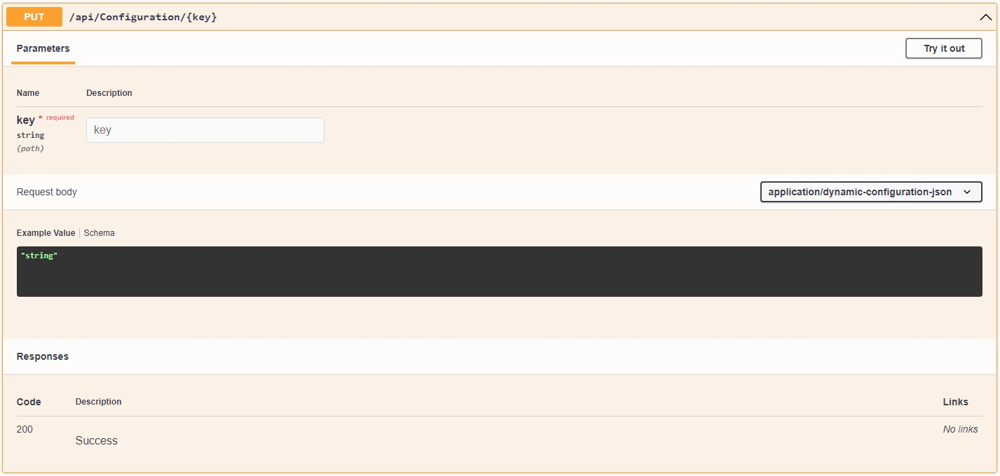

# Aguacongas.DynamicConfiguration.WebApi

Library to add configuration Web API to an ASP.NET 6 web site.

## Setup

**Program.cs**

```cs
using Aguacongas.DynamicConfiguration.Redis;
using Yarp.Configuration.Model;
using Swashbuckle.AspNetCore.SwaggerUI;
using Aguacongas.DynamicConfiguration.WebApi.Controllers;

var builder = WebApplication.CreateBuilder(args);

var configuration = builder.Configuration;
// Add Redis configuration provider.
configuration.AddRedis(options => configuration.GetSection(nameof(RedisConfigurationOptions)).Bind(options));

var services = builder.Services;
// Add services to the container.
services.Configure<ReverseProxyOptions>(configuration.GetSection(nameof(ReverseProxyOptions)))
    .AddAuthorization(options =>
    {
        // The web api requires 2 policies, DYNAMIC_CONFIGURATION_READER_POLICY and DYNAMIC_CONFIGURATION_WRITTER_POLICY
        // In this sample those policies requires nothing, all users have access to the api.
        // You should update this code to meet your requirement.
        options.AddPolicy(ConfigurationController.DYNAMIC_CONFIGURATION_READER_POLICY, 
            builder => builder.RequireAssertion(context => true));
        options.AddPolicy(ConfigurationController.DYNAMIC_CONFIGURATION_WRITTER_POLICY, 
            builder => builder.RequireAssertion(context => true));
    });

services.AddAuthentication(); // this sample doesn't have authentication system but shoudl add yours.

services.AddTransient(p => builder.Configuration as IConfigurationRoot)
    .AddControllersWithViews()
    .AddConfigurationWebAPI(options => options.Provider = ((IConfigurationRoot)configuration).Providers.First(p => p is RedisConfigurationProvider));
    
services.AddRazorPages();

services.AddSwaggerGenFromConfiguration(configuration);

var app = builder.Build();

// Auto reload the configuration when changes occur.
app.SubscribeToConfigurationChanges();

// Configure the HTTP request pipeline.
if (app.Environment.IsDevelopment())
{
    app.UseWebAssemblyDebugging();
}
else
{
    app.UseExceptionHandler("/Error");
    // The default HSTS value is 30 days. You may want to change this for production scenarios, see https://aka.ms/aspnetcore-hsts.
    app.UseHsts();
}

// Configure the HTTP request pipeline.
if (app.Environment.IsDevelopment())
{
    app.UseSwagger()
        .UseSwaggerUI(c =>
        {
            configuration.GetSection(nameof(SwaggerUIOptions)).Bind(c);
        });
}

app.UseHttpsRedirection()
    .UseBlazorFrameworkFiles()
    .UseStaticFiles()
    .UseAuthentication()
    .UseAuthorization();

app.MapRazorPages();
app.MapControllers();
app.MapFallbackToFile("index.html");

app.Run();
```

**appsetting.json**

```json
{
  "AllowedHosts": "*",
  "RedisConfigurationOptions": {
    "ConnectionString": "localhost",
    "HashKey": "Aguacongas.DynamicConfiguration.AdminApi",
    "Channel": "Aguacongas.DynamicConfiguration.AdminApi.Channel"
  },
  "OpenApiInfo": {
    "Title": "DynamicConfiguration Admin API",
    "Description": "API used to manage YARP.",
    "Version": "v1",
    "Contact": {
      "Name": "Olivier Lefebvre",
      "Email": "olivier.lefebvre@live.com",
      "Url": "https://github.com/aguacongas"
    }
  }
}
```
## Gets a configuration


## Sets a configuration

